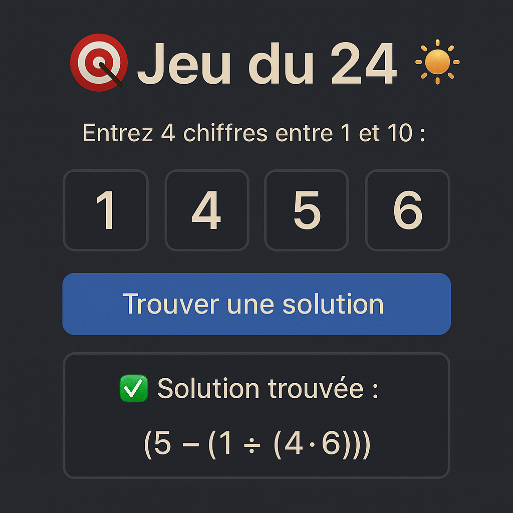

# 🎯 Jeu du 24

Ce projet est une petite webapp interactive développée en HTML, CSS et JavaScript, permettant de jouer au célèbre **jeu du 24**.

## 🕹️ Règle du jeu

Vous devez **trouver une expression mathématique qui donne 24** en utilisant les **quatre chiffres** proposés, chacun **exactement une fois**.
Les opérations autorisées sont : `+`, `-`, `×`, et `÷`.

Exemple :
Pour les chiffres `4, 1, 8, 7`, une solution est :
`((7 - 1) × (8 - 4)) = 24`

## 🚀 Fonctionnalités

- Interface responsive (adaptée aux mobiles et aux écrans larges)
- Saisie rapide avec passage automatique au champ suivant
- Clavier numérique sur mobile
- Animation visuelle en cas de succès ou d'échec
- Bouton de réinitialisation
- Favicon personnalisé
- Animation d’intro
- **Déploiement facile via GitHub Pages**

## 📦 Installation

Clonez ce dépôt :

```bash
git clone https://github.com/yilas/jeu-du-24.git
cd jeu-du-24
```

Ouvrez `index.html` dans un navigateur.

## 🌐 Déploiement sur GitHub Pages

1. Activez GitHub Pages dans les paramètres du dépôt (branche `main`, dossier racine).
2. Accédez à votre site à l’adresse :
   `https://votre-utilisateur.github.io/jeu-du-24/`

## 🧱 Structure du projet

```text
jeu-du-24/
├── index.html        # Page principale du jeu
├── style.css         # Styles et animations
├── script.js         # Logique du jeu
├── favicon.png       # Icône du site
└── README.md         # Documentation
```

## 🖼️ Aperçu



## 📄 Licence

Distribué sous la licence BSD 2-Clause "Simplified".

```text
Copyright (c) 2025, Yann Ilas
All rights reserved.

Redistribution and use in source and binary forms, with or without
modification, are permitted provided that the following conditions are met:

1. Redistributions of source code must retain the above copyright notice,
   this list of conditions and the following disclaimer.
2. Redistributions in binary form must reproduce the above copyright notice,
   this list of conditions and the following disclaimer in the documentation
   and/or other materials provided with the distribution.

THIS SOFTWARE IS PROVIDED BY THE COPYRIGHT HOLDERS AND CONTRIBUTORS “AS IS”
AND ANY EXPRESS OR IMPLIED WARRANTIES, INCLUDING, BUT NOT LIMITED TO, THE
IMPLIED WARRANTIES OF MERCHANTABILITY AND FITNESS FOR A PARTICULAR PURPOSE ARE
DISCLAIMED. IN NO EVENT SHALL THE COPYRIGHT HOLDER OR CONTRIBUTORS BE LIABLE
FOR ANY DIRECT, INDIRECT, INCIDENTAL, SPECIAL, EXEMPLARY, OR CONSEQUENTIAL
DAMAGES (INCLUDING, BUT NOT LIMITED TO, PROCUREMENT OF SUBSTITUTE GOODS OR
SERVICES; LOSS OF USE, DATA, OR PROFITS; OR BUSINESS INTERRUPTION) HOWEVER
CAUSED AND ON ANY THEORY OF LIABILITY, WHETHER IN CONTRACT, STRICT LIABILITY,
OR TORT (INCLUDING NEGLIGENCE OR OTHERWISE) ARISING IN ANY WAY OUT OF THE USE
OF THIS SOFTWARE, EVEN IF ADVISED OF THE POSSIBILITY OF SUCH DAMAGE.
```

---

🧙‍♂️ Si vous clonez ce dépôt et que vous l'aimez, n'hésitez pas à me mentionner... Ça me fera briller les yeux comme si j'avais trouvé une solution au jeu du 24 en moins de 3 secondes.

---

© 2025 – Yann Ilas
